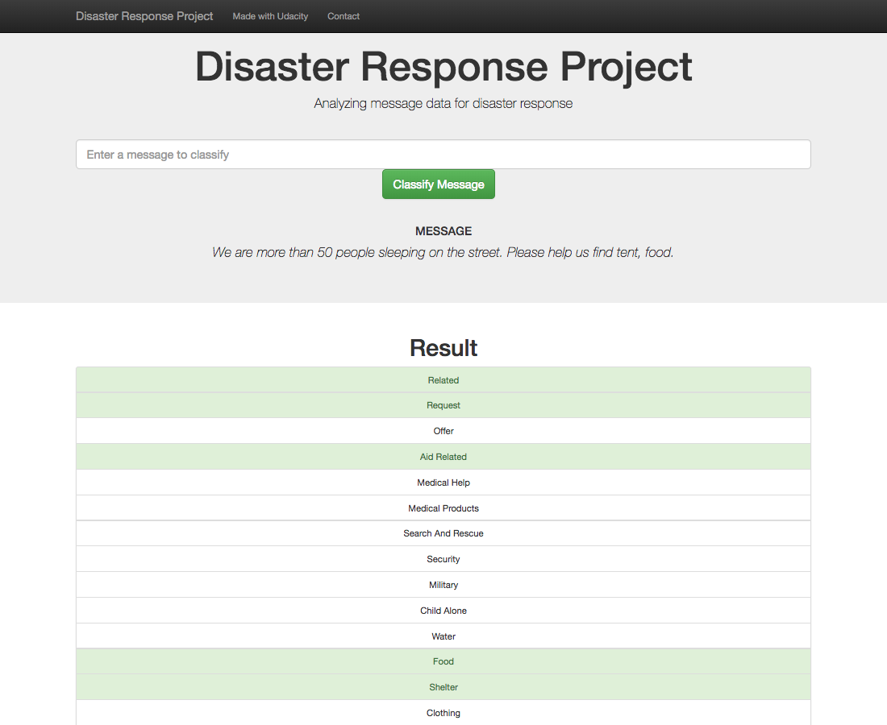

<h1>Disaster Response Pipeline Project</h1>

**Table of Contents**
- [Project Overview](#project-overview)
- [File Description](#file-description)
- [Instructions](#instructions)
- [Results](#results)

# Project Overview
In this project, we'll have a data set containing real messages that were sent during disaster events. I will be creating a machine learning pipeline to categorize these events so that user can send the messages to an appropriate disaster relief agency.

The project also includes a web app where an emergency worker can input a new message and get classification results in several categories. The web app will also display visualizations of the data.

Expect final results are as below:

# File Description
Our workspace is organized as below:
  - **app folder**: include html template and flask python file to run the app
    - template
      - master.html # main page of web app
      - go.html # classification result page of web app
    - run.py # Flask file that runs app
  - **data folder**: store raw data and processed data in sqlite. ETL pipeline used to clean and save data is also here.
    - disaster_categories.csv  # data to process 
    - disaster_messages.csv  # data to process
    - process_data.py # etl pipeline to clean and save data
    - DisasterResponse.db   # database to save clean data to
  - **models folder**: 
    - train_classifier.py # ml pipeline to train our models
    - classifier.pkl  # saved model 
    - customer_transformer.py  # customized feature used to train model 
  - images # folder to store images used to illustrate results
  - ETL Pipeline Preparation.ipynb # test notebook
  - ML Pipeline Preparation.ipynb # test notebook
  - requirements.txt # Python libs used in this project
  - README.md

# Instructions
1. Run the following commands in the project's root directory to set up database and model.

    - To run ETL pipeline that cleans data and stores in database
        `python data/process_data.py data/disaster_messages.csv data/disaster_categories.csv data/DisasterResponse.db`
    - To run ML pipeline that trains classifier and saves
        `python models/train_classifier.py data/DisasterResponse.db models/classifier.pkl`

2. Go to `app` directory: `cd app`

3. Run your web app: `python run.py`

4. Open web browser and enter: `http://localhost:3000/` to access the app

# Results

Our best results so far using the algorithm: XGBoost
| Metrics              | Results |
|----------------------|---------|
| Accuracy             | 97.07%  |
| Precision of class 0 | 96.99%  |
| Precision of class 1 | 94.36%  |
| Recall of class 0    | 98.45%  |
| Recall of class 1    | 60.35%  |
| F1 of class 0        | 97.66%  |
| F1 of class 1        | 71.73%  |
